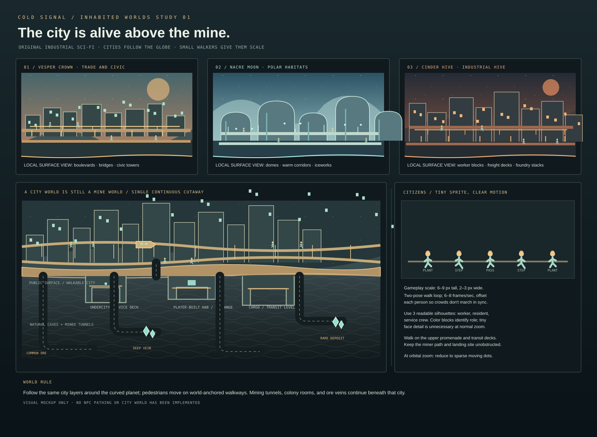

# Civilized worlds and Vesper system expansion

## Direction

The playable map should grow from a list of isolated worlds into a navigable solar system: rocky planets and moons orbiting gas giants, with each moon treated as a full mining destination. Some worlds are frontier/mining colonies; others are inhabited, highly developed city worlds. Both remain explorable and mineable. This is a future campaign layer, not current implementation.

The inhabited worlds should feel unmistakably populated from orbit and at the surface. Their cities climb above the curved horizon in dense, stacked layers: landing decks, low-rise industrial blocks, transit bridges, residential towers, and a distant upper skyline. Aim for the scale and vertical density of a planet-wide megacity such as Coruscant or a hive city, while keeping the game's own industrial sci-fi identity. Use original art and silhouettes; those references describe scale and atmosphere, not assets to copy.

The three circular insets are the primary world designs: the built city wraps around the whole sphere in continuous population belts. The adjacent wide scenes are only local camera views of those same globes, not flat planet maps. The city's layers, walkways, lights, and citizen routes must follow the planet coordinates through both hemispheres and the twisted surface seam.

The city is not a solid, unmineable shell. Surface districts are the visible inhabited layer. Beneath them, the player can descend through service levels, foundations, old infrastructure, and deep natural geology. Underground remains a real mining space, with ore, tunnels, build sites, and hazards. On a civilized planet, the long-term colony fantasy includes building useful underground facilities as well as expanding above-ground settlements.

## World roles

- **Mining/frontier worlds:** sparse surface settlements, exposed terrain, local player-built colonies, and comparatively easy access to raw ore.
- **Civilized worlds:** large existing populations, layered megacities, established services and trade buyers, and constrained places where the player can land/build among residents.
- **Gas giants:** large, visually prominent orbiting bodies that organize the system map. Their moons are the landable and mineable gameplay worlds; the gas giant itself is a backdrop/atlas object unless a later scoped design gives it a playable surface.
- **Unsettled moons:** smaller mining/exploration worlds around gas giants, each with a distinct ore mix, terrain, and route value.

Keep planet identity legible without making every civilized world the same: use a shared language of inhabited layers, windows, transit, and traffic, then give each world a distinct palette, architecture, skyline density, and economic role.

## Population-to-demand loop

Population should give the ore economy a clear cause and effect:

1. A civilized world's starting population creates visible baseline demand for selected ores.
2. The player invests credits, mined materials, and completed supply projects into that world. Investments might expand housing, life support, power, transit, or industrial districts; initially present these as a small number of clear projects rather than a deep city-management simulation.
3. Successful investment increases the world's population tier and improves its capacity to buy ore. Show the population change in the skyline and on the system map.
4. More residents and industry increase demand. The player can sell more of the demanded ore before local supply saturation pushes its price down.
5. Demand remains ore-specific. Flooding one world with one ore lowers the offer for that ore there. Trading Posts on other worlds distribute sales among more buyer pools, so prices fall more slowly across the connected network.
6. The cycle motivates exploration: identify a world with demand, mine what it needs, invest to grow its buyers, then connect another market before oversupplying the first.

Population growth should be deliberate and bounded. It must not mean credits arrive endlessly without player activity. Let investment unlock larger buyer capacity and recurring income only if needed for the economy; if used, keep the payment modest, capped, and clearly tied to a funded project. Mining, exploring, and shipping should stay valuable.

The player directs growth through legible choices, not resident-by-resident micromanagement. A project card could say `Expand habitats · costs X · adds population capacity · raises copper/iron demand`. Show the investment cost, time/mission requirement if any, new population tier, and ore-demand effect before commitment. Keep base prices stable; make the visible modifiers be population demand and recent sales saturation.

## Surface and underground play

- Show the existing city as multiple built layers following the globe's curvature, with traversable landing/colony bands at ground level and skyline layers continuing upward into the distance.
- Design every civilized world as a full globe first. Continue inhabited districts around both hemispheres; do not make a single city strip that stops at the visible edge or repeats as an unrelated background. The local surface scene is a camera view of the globe at the miner's longitude.
- Anchor skyline districts, transit levels, public walkways, lights, and pedestrian paths to wrapped surface coordinates. At the chart seam, city geometry and walking paths must continue without a gap or a pop; in the far hemisphere, the structures rotate with local gravity and tangent just like terrain and the miner.
- Landed Travel Ship remains intact and usable. Civilized worlds are reachable through the same system travel map as mining worlds; they are not locked behind an economy minigame.
- Preserve clear player build areas around the landing site. Existing buildings can establish the populated identity, while the player places local Trading Posts, repair/service buildings, and later city-growth projects where they fit.
- Let the player enter beneath the city into underground service levels and natural rock. Support mining and player-built underground facilities without requiring the player to excavate the entire city foundation.
- Keep local construction readable and compact. A large skyline is atmosphere and city identity; it should not turn every ground-level service interaction into platforming through dozens of layers.
- Population tier should update a few visible skyline elements and map icons. Avoid simulating individual residents or complex schedules in the first version.

### Walking people

- Add small visible pedestrians on the upper public promenades, bridges, and transit platforms. They should make the city feel alive while staying secondary to the miner and readable ore.
- Use original 6–9 px-tall sprite/vector figures at normal gameplay scale, with 2–3 color blocks and no face detail. Start with three role silhouettes: resident, worker, and service crew.
- Use a short 2-pose walk loop at a slow pace. Phase neighboring walkers so they do not move in lockstep. Add occasional idle/turn poses only after the basic scene reads well.
- Walkways are world-anchored to the curved planet, not drawn as a screen-space strip. Walkers follow them in both hemispheres and remain attached through the surface seam. City residents stay on their own decks and do not block the player's lane, landing area, drill, or build preview.
- Use deterministic placement and phase from world seed/longitude so the same citizens appear after reload. Do not simulate individual lives, collisions, schedules, or gameplay needs in the first visual pass.
- At orbital zoom, simplify people to a few sparse moving lights/dots. Do not allocate or animate a dense crowd across every city structure.
- Keep the scene quiet: sparse groups with visible gaps, stronger activity near transit and market spaces, and only a handful of figures near the player camera. This gives population a readable look without burying the working surface in motion.

## System map and orbit

The star map should show a large but readable system: a central star, gas giants on their orbits, and smaller moon markers around those giants. The existing game planets can be placed as moons or rocky bodies in that structure; this is a presentation/map relationship and does not need orbital simulation. Selecting a body shows its type, population, economic role, ore demand, current saturation, player colony links, and whether the Travel Ship can reach it.

Travel may remain a direct planet-to-planet selection initially. Orbit animation can communicate the gas-giant/moon relationship without making players wait for orbital alignment. A later navigation layer can add travel range or fuel only if it creates meaningful choices and is separately balanced.

## Multiplayer recommendation

The game can support multiplayer as a future feature, but it should not shape or block the current single-player economy. First finish a satisfying offline loop for mining, building, demand, population growth, and travel. Then evaluate **small co-op** as the first multiplayer form: two or a few players sharing one planet, colony, and campaign save. Cooperative roles could include mining, building, defending, and scouting.

Do not promise competitive play, shared public markets, persistent servers, or account-linked economies yet. Those introduce synchronization, hosting, save ownership, cheating, and economy-exploit problems. Keep the economy deterministic and local now; if co-op is approved later, define host authority and shared progression as a dedicated technical design before implementation. The current version remains single-player/offline.

## Suggested order

1. Complete and balance the current offline multi-world ore demand/saturation and Trading Post loop.
2. Create one inhabited destination as a visual and gameplay prototype, reachable by the Travel Ship, with skyline layers and a mineable underground beneath.
3. Add a small set of explicit city investment projects and connect population tiers to ore buyer capacity/demand.
4. Expand the system atlas to show gas giants and orbiting moon destinations; keep navigation direct and fast.
5. Build more inhabited and frontier worlds from reusable planet-specific surface and underground art kits.
6. Revisit small co-op only after the single-player campaign and save model are stable.

## Scope boundary

This document records future direction. It does not add multiplayer, NPC simulation, population management UI, orbital physics, or a backend to the current game. Prototype one world and a small number of deterministic investment effects before expanding the economy or world count.
