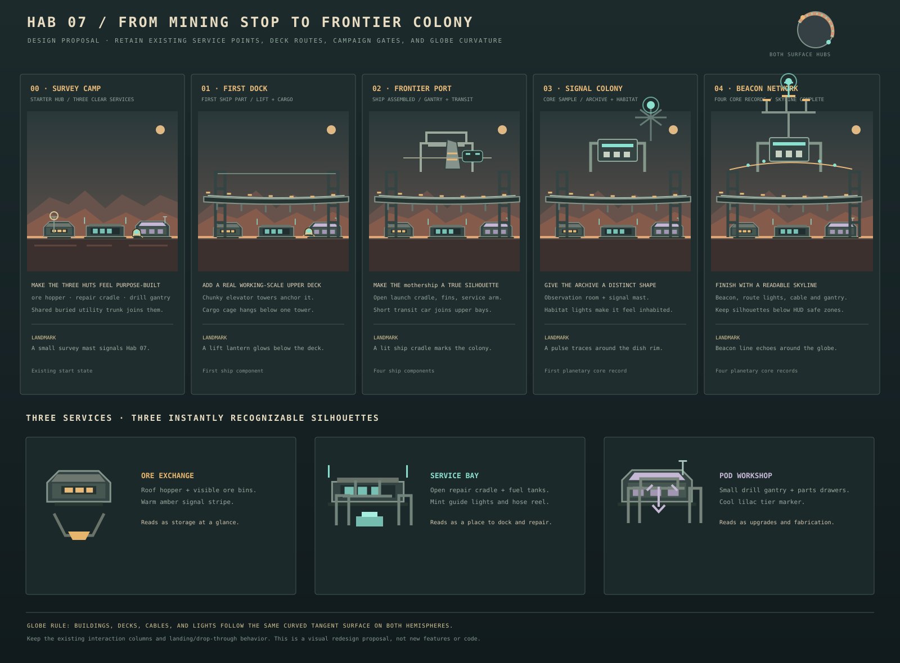

# Hab 07 colony design handoff

## Goal

Make the miner town feel like a small working settlement that grows into a frontier colony, while keeping the recognizable Hab 07 industrial language. Improve the buildings' silhouettes and visible function before adding more structures or systems.

The visual board is the design direction for an in-progress art pass. Curved station silhouettes now distinguish the ore exchange hopper and bins, the service cradle and fuel tanks, and the workshop drill gantry and drawers. Planet accents use small color cues. The current curved decks, interaction points, service rules, unlock conditions, and save data remain the implementation contract. Do not change gameplay or add NPC schedules, housing needs, crafting, or new resources as part of the art pass.

## Visual design board

The board proposes five progression stages and three service-hut identities, drawn with the current game's dark teal materials, blocky forms, warm/mint signals, and curved surface placement.

## What needs improvement

The current settlement already has useful pieces: three service huts, a ship assembly silhouette, elevated one-way decks, a tram, archive antenna, beacon, and workers. They are drawn in globe-aware tangent coordinates. The visual weakness is that most huts share one small rectangular shape, details are thin window bands, and the skyline reads as a collection of UI destinations before it reads as a functioning town. Several systems have no exterior visual clue for what happens inside them.

## Building language

Use a compact kit of dark green-grey structural frames, pale weathered metal edges, warm Hab utility lights, and mint signal/fuel indicators. Prefer simple blocks, chamfered corners, short braces, visible feet, and readable roof profiles. Keep each module to a handful of large shapes that remain legible at normal gameplay zoom.

Every building should have one recognizable function cue:

- **Ore Exchange:** a roof hopper, visible loading chute, and two or three ore bins. Amber bands mark cargo flow; the hopper is a silhouette cue, not a new hauling mechanic.
- **Service Bay:** a wider door, open repair cradle, two squat fuel tanks, and a hose reel. Mint work lights mark the vehicle interface.
- **Pod Workshop:** a small overhead drill gantry, a suspended tool/bit shape, and side parts drawers. Lilac trim connects it to the existing workshop color.
- **Hab 07 core:** the central recognizable home module, with a warm airlock window, antenna mast, and foundation footings. Keep the standard Hab emblem visible on both surface hubs.
- **mothership cradle:** an open gantry around the existing ship silhouette. Its support frame, engine bell, folded fins, and lit launch rail make assembly progress visible without adding a new objective.
- **Archive station:** a low, broad observation cabin with a dish or signal fork mounted above it. Its lights pulse gently only when appropriate and obey reduced-motion settings.

Keep a shared buried service trunk between the three original service buildings. Use short, clearly supported pipes/cable runs and color-coded couplers, so the cluster feels planned without filling the ground with spaghetti lines.

## Growth using current milestones

The town should visibly grow at the progression gates the game already has. Preserve the existing `surfaceTownTier` mapping and avoid introducing new save fields.

| Existing town stage | Trigger already in game | Visual build-out |
| --- | --- | --- |
| Survey Camp | Starting state | Three function-specific service huts, Hab marker, simple cargo pallets, landing apron and low utility trunk. |
| First Dock | First mothership component | First curved upper deck, heavier elevator frames, cargo cage and the start of the launch cradle. |
| Frontier Port | All ship components installed | Readable assembled mothership in its gantry, a small transit car, upper work bay and connected deck railing. |
| Signal Colony | First planetary core record | Archive observatory and signal mast, one upper habitat module, and a subtle signal light. |
| Beacon Network | Four planetary core records | Finished upper beacon, a few lit route segments, additional braced deck supports, and the complete shipyard silhouette. |

Each stage should add one strong piece to the skyline, then several smaller supporting details. Avoid simply adding more platform height; keep the central service buildings visually prominent and the miner easy to spot.

## Fit to the globe and play space

- Build all architecture from the existing tangent/radial surface coordinates. The near and far Hab 07 towns share the same design and curve around their own crust.
- Break long decks into several short curved chords with visible supports. Railings, ladders, cables, and lights follow the same local arc; they must not look like flat screen-space bars when travelling around the planet.
- Keep the current one-way landing/drop-through behavior and platform elevations. The concept's rounded/segmented edges are visual only; do not alter collider shapes or altitude limits.
- Keep service points at the current three world positions so their labels and controls still line up. Give the hut silhouette enough separation that each one is recognizable behind its label.
- Keep important structure edges and active landing surfaces clear of the HUD. At 800×600, the pod and top-deck landing area remain visible.
- Treat cables and decorative pipes as non-colliding lines with very low visual weight. Never draw them over the pod, crosshair, current objective, or ground edge.

## Planet-specific dressing without losing Hab 07 identity

Reuse the same building kit across all six worlds, then apply a small amount of local dressing:

- Mars Frontier: dust shields, sand-buried footings, and a wind sock.
- Cryo Shelf: insulated pipe jackets, low snow skirts, and frost on shaded corners.
- Hull Graveyard: a few ark-metal braces or salvaged plates bolted onto the standard frames.
- Prism Fault: one or two faceted protective panels with restrained lavender edge light.
- Cinder Vale: dark heat shields and tiny refractory-orange warning lamps.
- Vesper-9: restrained leaf-green signal glass and small living-crystal lamps.

Keep these accents to about 10–15% of the silhouette. The shared Hab shape, warm windows, and mint operational lights should still identify the settlement at a glance.

## Animation and liveliness

Use only a few slow, small loops: a service light turns on during a service interaction, the transit car moves only when the player rides/uses existing travel, a dish marker sweeps once, and the beacon gives a contained pulse. The town can show one or two tiny crew silhouettes on existing decks, but they should not steal attention from the miner or imply an NPC interaction system. Stop or simplify all nonessential movement under reduced motion and pause.

## Acceptance checks for the coding agent

- At starter progression, players can tell which hut sells ore, services the pod, and offers upgrades from its silhouette and a small prop cue.
- Each current town tier adds a visibly meaningful skyline change tied to the existing milestone; the mothership's assembly is easy to read.
- The colony remains recognizable from both surface hubs and at orbital overview scale as a small paired settlement attached to the globe.
- Decks, structures, lights, and cables follow planetary curvature on both hemispheres and have no seam pop.
- Existing station interaction coordinates, one-way platform behavior, player collision, saving, and service logic stay unchanged.
- The pod, station labels, ship objective, and current surface edge remain readable at desktop and 800×600. Reduced-motion and paused states suppress nonessential loops.
- Render the full progression board in-game and inspect each unlock stage before calling the art pass done; a static concept sheet alone does not verify curved alignment.

## Current implementation references

The tier mapping and reachable town altitude are in `src/game/surface/SurfaceStation.ts`. Curved Hab buildings and service identities are drawn by `drawPlanetSurfaceOutpost` and `drawSurfaceTown` in `src/game/surface/SurfaceTown.ts`; `MiningScene` supplies each map's planet projection, planet accent, and town milestone state. The existing surface traversal results are in `docs/QA.md`; browser inspection of the new silhouettes and the remaining player-feel check are tracked in `docs/NEXT_SPRINT.md`.
