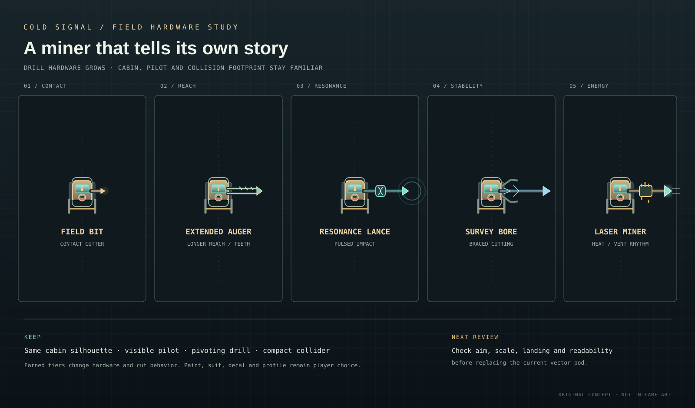

# Miner visual progression roadmap

The miner should visibly grow from a small, bare starter pod into a larger, more advanced machine as upgrades are purchased. [The upgrade visual map](miner-upgrade-visual-map.svg) now maps every existing upgrade level and purchased equipment to a specific visible part. Three broader base identities remain available in [the character directions study](miner-character-directions-v1.svg); whichever identity is chosen, it follows the same upgrade language. These are original design studies, not replacement sprites or a promise to expand the miner's collision body.

| Drill tier | Workshop name | Readable hardware change | Cut animation accent |
|---|---|---|---|
| 1 | Field Bit | Short single contact bit; narrow nose | Compact extension, small warm contact flash |
| 2 | Extended Auger | Longer twin rails and visible auger teeth | Repeating tooth glint while cutting |
| 3 | Resonance Lance | Coil collar around the drill rail | Matching-color pulse rings at breakthrough |
| 4 | Survey Bore | Braced nose and stabilizer struts | Brace settles on impact; controlled recoil |
| 5 | Laser Miner | Long emitter, heat fins, mint cutting channel | Heat rises during a sustained cut, then a brief visible vent |

## Appearance changes for all current upgrades

| Existing upgrade | Visible progression |
|---|---|
| Drill, levels 1–5 | Contact bit → longer auger rails → resonance collar → stabilizer frame → laser emitter and heat fins. Every tier changes the nose silhouette. |
| Cargo bay, levels 1–5 | Flush starter compartment → small side bins → paired bins → broad ribbed ore cassette with loading lights. This is the main source of width/rear-mass growth. |
| Fuel tank, levels 1–5 | Single compact canister → larger banded canister → paired tanks with visible valve collars. Keep it visually distinct from cargo. |
| Hull, levels 1–5 | Add layered shell plates, reinforced corners, and more substantial landing skids. Decoration must remain within the same collision capsule. |
| Engine, levels 1–5 | Small exhausts become twin vector-nozzle housings with brighter cores; thrust animation scales with engine level. |
| Survey scanner, levels 1–5 | Roof antenna → paired sensor fins → compact dish/mast; use a short visible sweep during a scan. |
| Auto grapple, levels 1–5 | Add hook sockets, then paired launcher housings and larger cable drums to show range/cooldown improvements. Hook animates only when catching. |

Purchased equipment also attaches visibly: salvage magnet gets pickup coils; stasis gets a belly stabilizer ring; Surface Winch gets a top spool and visible cable when reeling; the escape suit gets a side-mounted pack that leaves with the pilot on ejection. Charge packs remain carried inventory and need not permanently enlarge the pod. Cosmetic paint, decals, and silhouette profile stay distinct from earned hardware. Pilot specialization is a selected performance path; any visual cue should be a small swappable label/light, not a different chassis.

## Shared parts and animation states

Keep the miner assembled from reusable vector shapes so tiers can share the same collision capsule and pilot position:

- **Chassis:** cabin shell, undercarriage, side armor, feet/skids, cargo bay, and a few panel highlights. Hull progression may add armor plates and modest side width; do not enlarge the collision body to match decorative growth.
- **Power pack:** replaceable rear tank and two status lamps. Fuel level should not add another survival meter or create a requirement for a new HUD bar.
- **Drill mount:** one pivot at the nose, a tier-specific head/rail/coil/frame/emitter, and the already implemented 360-degree aim. Keep decorative attachments clear of adjacent mineable cells.
- **Recovery attachments:** winch spool and cable guide; grapple housings that stay visually quiet until a catch; charge rack; salvage-magnet pickup halo. These identify installed equipment without changing optional cosmetic choice.
- **Pilot:** helmet window and one high-contrast visor highlight. Preserve pilot visibility inside the largest pod scale and during escape-suit ejection.

Use a small set of shared poses rather than a bespoke animation per tier: idle bob; lateral thrust; braking; drill extension and recoil; hard-impact brace; grapple tension/catch; winch pull; charge release; laser heat build/vent; and pilot ejection. Reduced-motion mode should retain static state cues and omit shake, pulsing, and camera-dependent flourish. Audio timing can accent the same cut/recoil/vent events without making movement noisy.

## Implementation guardrails

The current game draws the miner with Phaser Graphics in `MiningScene`; this sheet is a design reference only. Implement later as functions/data for chassis modules and drill modules, with color/material inputs from the equipped cosmetics. Keep progression modules mechanically distinct from cosmetic finishes. Validate every tier at the starter and maximum visual scales, aim in all directions, both gravity hemispheres, docking, and terrain contact. Browser review should check target readability at normal play zoom and orbital zoom before the sheet is treated as approved art.

Current implementation covers drill tiers, modest pod growth, a 360-degree drill pivot, hardware cues for all seven purchased upgrade tracks, optional installed equipment, breakthrough effects, and tier-five heat/vent behavior. Drill and cargo levels account for pod growth; fuel, hull, engine, scanner, and grapple levels add separate art parts without changing the collision footprint. The three base identities remain art directions, and browser/human review at varied zoom and depth is still needed before treating the silhouettes as final.
