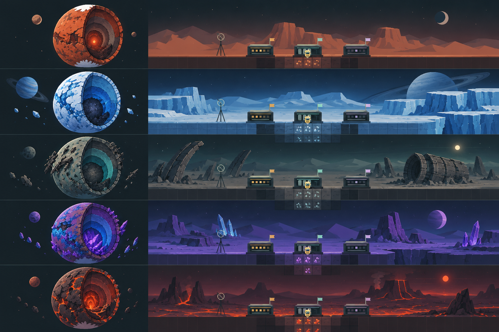
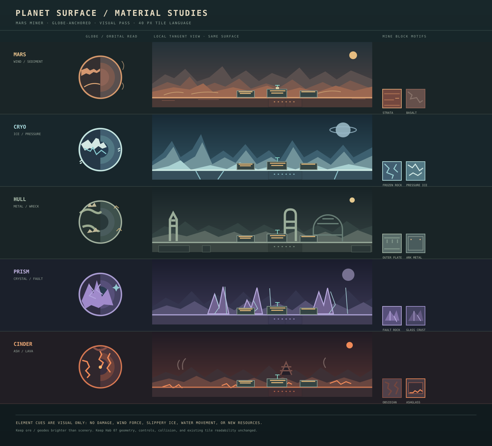

# Planet surface art and world-feel guide

## Purpose

Make arriving on each planet feel like entering a different place. The surface should communicate climate, geology, scale, and a little story before the player drills. It should also reward travelling around the globe: a planet is a continuous landscape, not the same short backdrop repeated at every landing.

This is a design and art handoff. It does not authorize gameplay-code changes. Keep the existing Phaser 3 procedural renderer and original-art rule. The first implementation should be visual-only: no new survival meters, water physics, swimming, or changes to terrain collision. Add block/material changes later as a separate, tightly scoped pass.

## Visual concept board

The first image is the current game's surface scene: flat angular mountain silhouettes, a simple gradient sky, square mine tiles, dark teal framing, and the original Hab 07 service buildings. Read the new board rows top to bottom in the existing planet order. Each row pairs a round-planet cutaway with a local surface view and the same small station/pod scale. It is a palette and composition proposal for this game, not a new high-detail art direction.

The SVG element sheet is the most direct style handoff: it uses the game's flat fills, compact palette, sharp shapes, familiar service-hut silhouettes, tile grid, and tiny glows. In each row, the globe communicates that the element wraps the planet, the horizon scene shows what the player sees at the surface, and the two blocks show how that material language continues underground.

This is concept art, **not** a drop-in background or final sprite sheet. The board still has more shading/detail than the game's current procedural art. The implementation should simplify it to crisp polygons and blocks: 2–4 tones per material, hard edges, sparse highlights, very little texture, and the existing flat-shaded silhouette language. Preserve the current station architecture and mine-tile grid. Use [the earlier globe study](concepts/planet-globes-v2.png) for circumference/cutaway layout detail and the [flat panorama board](concepts/planet-surfaces-v1.png) only for local color inspiration; neither overrides the current game's style reference.

## Globe-first layout rules

Design every feature in planet coordinates first; make a close-up view from those same coordinates second. A local surface panorama is only a camera crop of one longitude, never the canonical world layout.

- Treat the existing outer chart edge as the true surface path. Place each landform, biome boundary, surface fissure, and landmark by wrapped longitude and small radial offset from that path. Use the existing planet chart projection for the home hemisphere, far hemisphere, and orbital cutaway.
- Distribute each planet's 4–6 broad biome zones around the full circumference. Use soft transitions, with a deliberate distinct far-side mix. Avoid a single north/south “top” landscape that cannot continue around the seam.
- Anchor fixed landmarks to longitude so they travel consistently with the ground. The Hab 07 and opposite-side hub remain visible focal points. No detached features should float near the globe.
- In the close view, rotate the local frame with the surface tangent as the camera already does. The nearby ground shelf stays locally level, while distant horizon forms bend/rotate consistently as the player moves. Never screen-scroll a flat mountain strip independently of longitude.
- Ensure the last biome before the twisted chart seam meets the first biome after it without a color, prop, or silhouette pop. Test both travel directions and both hemispheres.
- Make the orbital cutaway and close view agree: a landmark visible on the globe must appear at the matching longitude and side when approached. At orbital zoom simplify to broad color regions and a few large silhouettes; do not show tile detail.

### Planet-by-planet circumferential map

These are placement concepts to make each globe coherent. Longitude fractions are approximate, wrap seamlessly, and do not define new gameplay regions.

| Planet | Circumference sequence | Globe signature | Local view landmark |
| --- | --- | --- | --- |
| Mars Frontier | Rust Basin → Split Mesa → Dune Shelf → Survey Scar → Rust Basin | Ochre deserts with several dark canyon arcs, weathered polar caps, and wind-carved ridges attached to the crust | Paired mesa arches and long dust ribbons |
| Cryo Shelf | Blue Shelf → Pressure Ridge → Mirror Fissure → Buried Hull Rise → Blue Shelf | Icy surface with dark branching crevasses, pale frozen basins, and a few buried-wreck marks | Tall pressure ridge against a ringed gas giant |
| Hull Graveyard | Landing Debris → Engine Arc → Impact Basin → Antenna Field → Landing Debris | One broken ark-fragment arc follows the crust, interrupted by bare impact terrain and regolith | Tilted engine bell and half-buried hull ribs |
| Prism Fault | Shard Plain → Fault Wall → Glass Mesa → Refraction Basin → Shard Plain | A few diagonal fault belts and discrete crystal fields; most of the surface remains readable dark rock | Three large prisms at an angular fault escarpment |
| Cinder Vale | Ash Plain → Caldera Rim → Obsidian Flow → Ember Fissure → Ash Plain | Dark crust with branching narrow fissures and one or two caldera scars; glow follows the crust | Low caldera silhouette with restrained lava seams |

The original board has no final grid/longitude values. The implementation should use deterministic seeded placement and record/derive feature longitudes consistently rather than placing landmarks relative to screen pixels.

## What exists today

- Five destinations are present: Mars Frontier, Cryo Shelf, Hull Graveyard, Prism Fault, and Cinder Vale.
- Each already has a distinct sky/ground/mountain palette and separate underground strata, ore weighting, and signature finds.
- The ordinary surface renderer uses a gradient sky, three distant mountain bands, a thin ground lip, and the shared Hab 07 / mothership skyline. The region palette changes, but the landscape language and nearby ground details are mostly shared.
- New maps use a round polar chart with a continuous wrapped surface, two playable hemispheres, and an orbital cutaway. At orbital zoom, the current planet is shown as broad concentric color bands; no detailed continent/terrain texture exists yet.
- Surface-town structures and the player's route already use curved tangent/radial world coordinates. New landscape art must follow the same curvature and remain continuous at the wrap seam.

## Art direction

Use **readable illustrated geology**, not a photorealistic terrain pack. Retain the game's restrained pixel-style shapes, strong silhouettes, dark industrial UI, and warm Hab 07 lights. Give each planet one dominant large-scale shape language, one secondary surface material, one atmospheric motion cue, and one memorable landmark family. Keep the miner, station labels, ship, surface decks, and sky-deck landing edges high contrast against every palette.

The landscape should have three depth planes, all framed by the same rotating local tangent camera:

1. **Far sky:** planet-specific celestial body, stars/haze, and broad color gradient. Treat the sky as distant around the planet; let camera rotation reveal it consistently as the player travels. Avoid an Earth-like sun/moon pair by default; each world can have one distinct sky event.
2. **Horizon:** two or three original silhouette layers at different apparent distances. Their shapes are associated with surface longitude/latitude and project around the sphere; parallax comes from their distance, not from scrolling a flat strip that slips away from the globe.
3. **Near surface:** non-colliding rocks, ice plates, glass shards, wreck ribs, dust drifts, or scrub silhouettes anchored to a small radial offset from the existing ground. Keep the collision surface and landing decks mechanically unchanged for the visual-first pass.

Use deterministic procedural placement keyed by map seed and wrapped surface coordinate. It must look identical after reload and at both hemispheres. Build features from reusable Phaser primitives or original small vector/pixel assets; do not make large per-frame allocations. At orbital zoom, use a few broad, recognizable surface regions and landmark marks rather than rendering every pebble.

## Planet art bibles

### Mars Frontier — wind-cut badlands

**Read at a glance:** a dry ochre world with long, eroded ridges and a low, dusty sky. Make it feel open and old rather than simply red.

- Palette: keep the existing rust/ochre ground; add muted cream dust, deep aubergine shadow, and a restrained pale sun. Reserve the brightest orange for thermal finds and Hab lights.
- Horizon: mesa steps, split buttes, long low ridgelines, and occasional wind-carved arches. Prefer broad layered silhouettes to repeated triangle peaks.
- Near surface: wind-ripple bands, sparse dark stones, shallow dune tongues, and a few broken survey stakes. Dust wisps travel mostly sideways and die down while paused/reduced-motion is enabled.
- Orbital read: broad rust plains broken by darker canyon arcs and a few pale sediment basins.
- Mining material extension: rust soil blocks get horizontal sediment bands; basalt gets angular dark faces. Keep the current ore silhouettes and color cues unchanged.
- Avoid: lush vegetation, saturated red everywhere, or making every ridge a sharp mountain.

### Cryo Shelf — fractured glacial moon

**Read at a glance:** blue-white ice over dark buried rock, with immense cracks and frozen pressure ridges.

- Palette: glacier cyan, chalk ice, blue-black crevasse shadow, and occasional mint reflected signal light. Keep surface highlights brighter than the blue-grey underground strata.
- Horizon: smooth distant ice shelves interrupted by jagged pressure ridges, crevasse fins, and a huge faint ringed planet or gas-giant arc.
- Near surface: layered snow lips, fractured ice plates, blue crack lines, small frost plumes, and slow ice motes. Use a few broad wind streaks rather than constant particle noise.
- Orbital read: pale polar cap, dark blue fissure network, and a subtle bright route seam near the mothership signal path.
- Mining material extension: ice blocks have translucent-looking edge bands and fracture lines; buried hull material keeps a warm metallic contrast. No slippery movement or ice-specific physics in this art pass.
- Avoid: making all blocks pale (ore visibility suffers) or using a busy snowstorm over the player.

### Hull Graveyard — wreck-strewn salvage moon

**Read at a glance:** a cold, airless wreck field where a dead ark has broken across the surface.

- Palette: charcoal teal, weathered green metal, dusty tan regolith, and sparse pale salvage lights. Keep orange reserved for warning glows and salvage callouts.
- Horizon: recognizable ship ribs, a tilted engine bell, torn habitat rings, and distant debris arcs. Vary scale and lean so the horizon does not look like a row of buildings.
- Near surface: plates half-buried in dust, snapped antennae, cables, and small clusters of wreck fragments. A few fragments can catch a slow, cold specular glint.
- Orbital read: one broken ring/arc of hull fragments and a dark impact basin; this gives the planet its own silhouette distinct from the other round globes.
- Mining material extension: outer plating blocks get seams/rivets and broken-deck strata get directional metal edges. Keep ore readable as separate luminous/colored silhouettes.
- Avoid: turning the surface into a dense junkyard that obscures the town, landing decks, or pod.

### Prism Fault — crystalline highlands

**Read at a glance:** a dark violet fault world pierced by enormous translucent crystal blades.

- Palette: indigo rock, lavender shadow, pale lilac highlights, and tiny cyan/rose refractions. Keep geodes as the brightest, crispest underground shapes.
- Horizon: fractured mesas, a few giant leaning prisms, and long angular fault escarpments. Crystal silhouettes should use repeated geometric rules, not random spikes.
- Near surface: glassy shards, thin reflective seams, faceted gravel clusters, and rare refracted light sweeps. Keep glints brief and low-area so they do not resemble ore markers.
- Orbital read: visible diagonal fault bands and a small number of bright facets crossing the surface.
- Mining material extension: glass-crust blocks show a simple faceted highlight and one edge color; geode art remains reserved for actual ore-bearing geodes.
- Avoid: rainbow gradients, constant sparkle, or surface crystal shapes that falsely promise mineable ore.

### Cinder Vale — volcanic ash and cooled lava

**Read at a glance:** an ash-dark volcanic world with glowing fissures and distant, subdued eruptions.

- Palette: black plum, iron red, ash grey, and ember orange. Make lava glow emissive-looking but narrow and infrequent; the Ember Heart remains the deepest/highest-value signal.
- Horizon: caldera rims, shield volcano profiles, stepped basalt flows, and occasional ash plumes. Use silhouette layering to imply depth, not full-screen fire.
- Near surface: sharp cooled-lava plates, ash drifts, glowing cracks that can be decorative surface seams, and a few slow rising ember motes. Pause and reduced-motion settings must stop/reduce motion cleanly.
- Orbital read: dark crust cut by branching ember fissures and one broad caldera basin.
- Mining material extension: ashglass has thin glassy highlights; obsidian has hard angular facets; sulfur gets a pale muted yellow edge; sealed magma uses restrained orange seams. Keep hot glow localized.
- Avoid: lava oceans, explosion hazards, damage, or heat meters. Those would be new mechanics outside this art request.

## Water and other future biomes

Treat water as a later visual biome option, not the first implementation. Place one or more ocean/lake regions as longitude arcs along the globe's outer surface, with shorelines that visibly follow the sphere and join at the seam where needed. At orbital scale they read as broad dark-teal basins; locally they become a clear horizon waterline with restrained foam marks, submerged cliff silhouettes, and slow caustic light. A visual water band does not need liquid simulation. If assigned to a future destination, choose one clear read—shallow frozen sea, hydrocarbon lake, or underground ocean—and preserve a solid walkable/minable crust for the current loop. Do not imply the pod can enter, float, or mine underwater until those mechanics are explicitly designed and tested.

Likewise, jungle/forest should belong to a future world with its own biological and lighting premise. Use large canopy silhouettes, sparse bioluminescent trunks, and root-like geology without introducing harvestable plants or crafting recipes. Deserts and barren wastes fit Mars and Cinder best; glaciers suit Cryo; wreck fields suit Hull; crystalline highlands suit Prism. Reuse biome vocabulary only when a planet's story supports it.

## Surface variety and world traversal

The current planet is a continuous wrapped strip projected to a globe, so scenery should be generated in longitude segments rather than attached to the player's screen. Define a small set of deterministic surface zones per planet—roughly 4–6 broad regions around the circumference—with soft transitions. Each zone chooses a horizon silhouette family, near-surface prop family, and one ambient cue. Keep the spawn/Hab 07 region and both mirrored surface hubs readable; the far hemisphere can have related but distinct landmarks.

Make exploration feel fresh through landmark silhouettes and changing horizons, not by adding tasks or rewards in this visual pass. A landmark should be visible from a distance, identifiable in the orbital view, and remain behind the player consistently as they travel. Do not put false ore glows or route markers in decorative scenery.

Suggested zone examples:

- Mars: Rust Basin → Split Mesa → Dune Shelf → Survey Scar.
- Cryo: Blue Shelf → Pressure Ridge → Mirror Fissure → Buried Hull Rise.
- Hull: Landing Debris → Engine Arc → Impact Basin → Antenna Field.
- Prism: Shard Plain → Fault Wall → Glass Mesa → Refraction Basin.
- Cinder: Ash Plain → Caldera Rim → Obsidian Flow → Ember Fissure.

These are visual labels/concepts, not new map regions, objectives, or save milestones.

## Mining-block art relationship

Do not replace shared geology with five unrelated tile sets at once. Use three controlled layers:

1. **Shared material grammar:** dirt reads as softer sediment; rock as fractured stone; hard rock as dense angular strata. Preserve the familiar value contrast and ore silhouettes.
2. **Planet surface treatment:** tint, edge trim, and a small number of deterministic motifs express local geology (strata, frost cracks, plate seams, facets, ashglass). Apply the same grammar consistently at every depth band so blocks still read as mineable material.
3. **Signature material only where it communicates a real distinction:** reuse existing region signature resources and stratum names. New block types, hardness, ore tables, yields, or geology rules require a separate design/balance request and centralized data in `src/game/config.ts`.

All new decorative seams must be visually distinct from ore, geodes, route signals, core relics, and hidden resources. Never reveal unseen ore on the surface or map. Keep each block readable at the current 40 px tile size and at orbital zoom; avoid details smaller than a few pixels that turn to noise.

## Shared implementation and acceptance guidance for the coding agent

When the art pass is commissioned, implement in this order:

1. Add data-driven surface-art descriptors to existing planet configuration: sky palette, horizon families, near-ground props, ambient motif, and orbital pattern. Keep descriptors visual-only and deterministic.
2. Replace the shared distant-mountain recipe with per-planet horizon silhouettes and modest per-longitude variation. Preserve the surface town as the foreground focal point.
3. Add the shallow near-surface decorative pass, clipped/curved to the globe's local tangent. Ensure the wrapped seam produces no pop and the far hemisphere's local frame remains correct.
4. Replace orbital concentric bands with low-cost planet-specific broad region marks and signature silhouette cues.
5. Only after surface QA, add restrained per-material block treatments. Do not alter collision, excavation, ore distribution, save schema, or return-fuel balance in the visual-only change.

Acceptance checks:

- A fresh arrival on all six maps is recognizable from color plus silhouette with the HUD hidden.
- Near-surface details stay subordinate to the pod, station/service labels, sky decks, and playable surface edge.
- Scenery is deterministic across reload, map travel, and seed reuse; it joins cleanly at the wrap seam and projects correctly on both hemispheres.
- Moving across longitude keeps the local ground tangent under the pod while fixed landmarks remain on the correct point of the globe; the orbital cutaway and local approach agree on every landmark.
- Orbital view remains readable at desktop and 800×600; planet colors/shapes remain distinguishable in grayscale or for common color-vision deficiencies.
- Decorative features do not look like ore, geodes, mission signals, build sites, or solid collision.
- No camera/UI overflow, no new browser errors, no collision changes, no save migration, and no ore visibility changes.
- Check reduced-motion behavior and visual performance with many visible scenery elements.

## Reference to current systems

Planet names, palettes, strata, and material rules are in `src/game/config.ts`. Surface and orbital rendering are orchestrated in `src/game/MiningScene.ts`; the shared Hab 07 skyline is drawn by `src/game/surface/SurfaceTown.ts`. Round-planet projection and seam behavior live in `src/game/world/PlanetChart.ts` and `src/game/world/Projection.ts`. Keep planet-specific art data centralized and rendering helpers small; do not put balance in the renderer.

For a deeper design of the service buildings, launch cradle, progressive colony skyline, and planet-specific Hab dressing, see the [Hab 07 colony design handoff](HAB07_COLONY_DESIGN.md).
