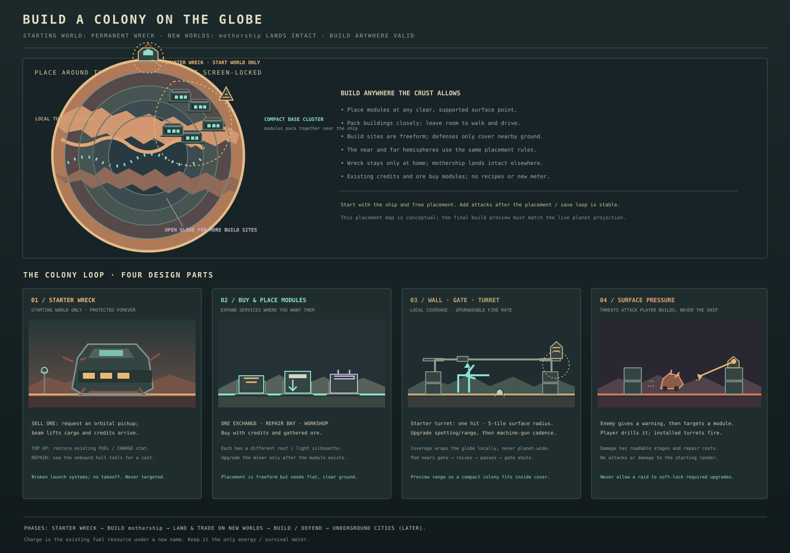
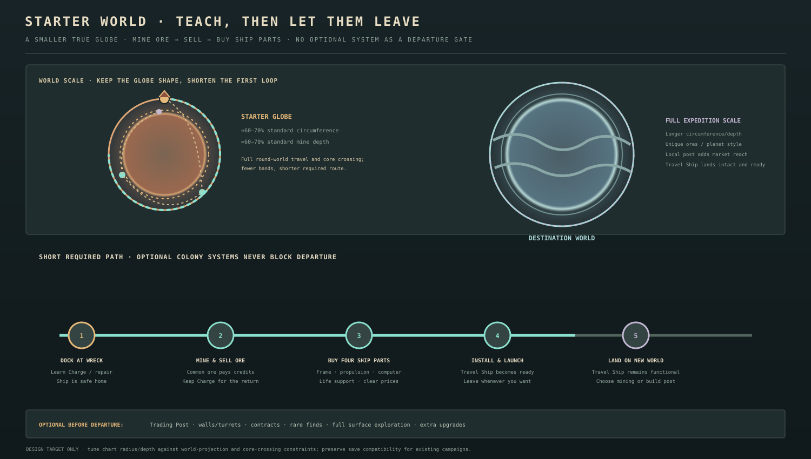
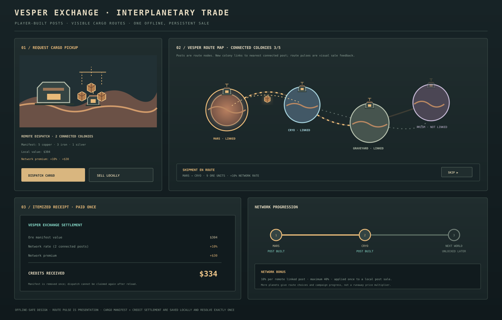
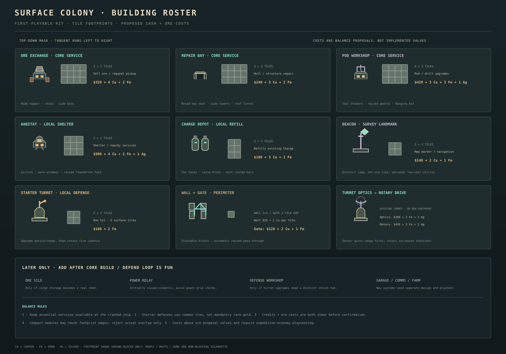
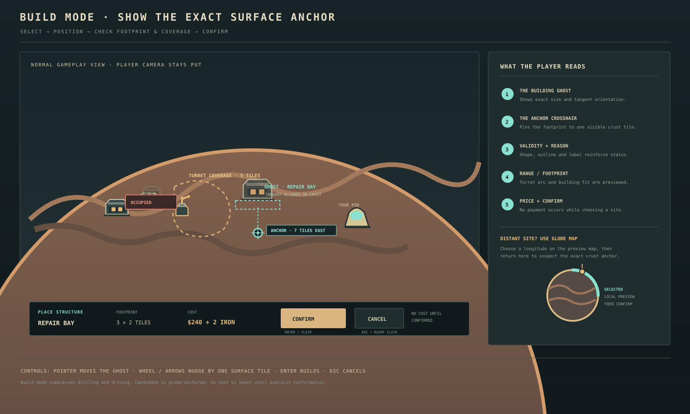
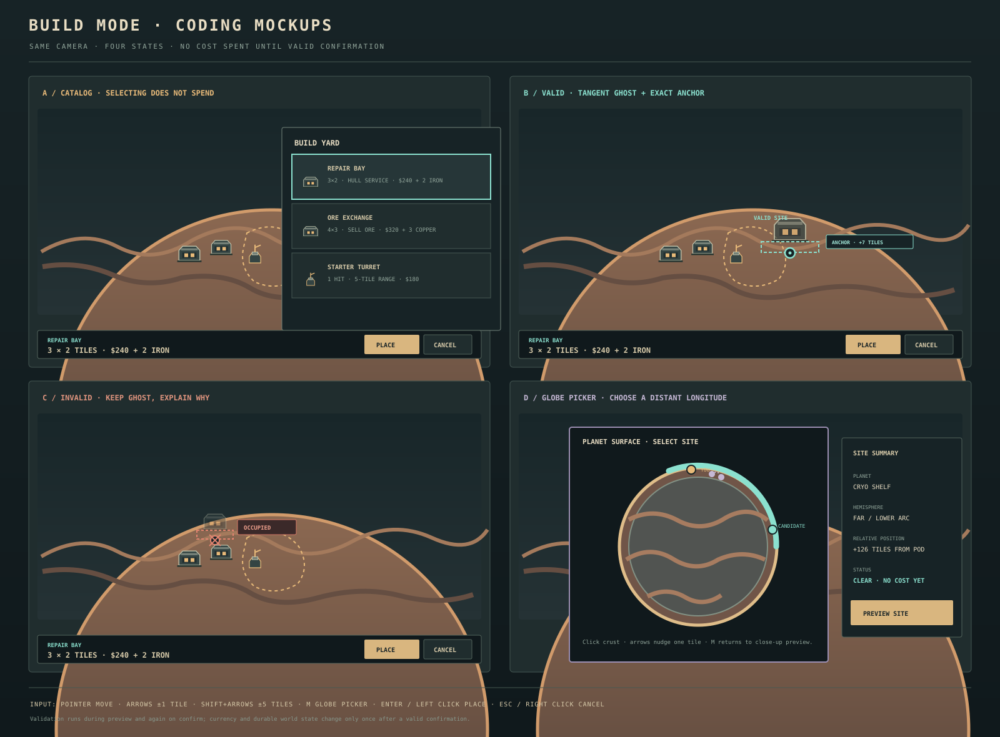

# Build-anywhere surface colony design

## Direction

The player begins at one crashed, permanently grounded starter ship and builds the first colony around it. Later, the player assembles the **Travel Ship**, a separate fully functioning spacecraft that carries them between planets. On every new world the Travel Ship lands intact and remains a usable, launch-ready ship; it does not become another wreck. Colony buildings, walls, gates, and defenses are purchased and placed by the player anywhere valid on each globe. Settlements emerge from player choices rather than fixed town sites.

The first colony slice now includes save-backed habitats, trading posts, swimmer-intercept pylons, and warning-based surface raids that can damage or destroy habitats and pylons. The crashed-ship pickup, free-placement preview, and broader surface threat variety remain design work. Walls and gates now have a first playable implementation. Cave threat variety now includes the telegraphed Shard Manta charge and Hull Graveyard's armored Hull Scrapper; surface threat variety still needs world-specific encounters and browser balancing. Underground cities stay a later expansion; keep the colony layer local and offline.

## Core loop

1. **Start at the wreck.** The first ship is broken, permanently grounded, and never damaged further. Its surviving systems provide basic sale, Charge, and hull-repair services.
2. **Call in an ore pickup.** The player requests collection, loose cargo is visibly gathered into a shipment, a tractor beam lifts it away, and the sale credits arrive. Treat this as a short local animation and timed transaction; no online market or backend is required.
3. **Buy and place services.** Spend existing credits and gathered ore on modules such as an Ore Exchange, Repair Bay, and Pod Workshop. The module must be built before its service or upgrade is available.
4. **Protect the colony.** Extend walls and gates, add turret mounts, and deal with surface threats using the drill or installed turrets. Surface enemies can damage player-built structures but never the ship.
5. **Mine, sell, and build the Travel Ship.** Mine ore, sell it at the Starter Wreck, and use the credits to buy four ship parts at the shipyard: a launch frame, propulsion unit, navigation computer, and life-support unit. Install all four to unlock travel. Route signals are optional exploration/story finds, never a ship-building requirement. The Travel Ship lands intact on new planets and remains ready for takeoff; the Starter Wreck stays on the starting world.
6. **Explore and expand.** All suitable surface locations around every globe are eligible. Habitats and service modules can form a compact colony around the local landed Travel Ship or another chosen site.

## Ship continuity across planets

- There are two distinct ships in the campaign: **Starter Wreck**, the first permanently broken ship, and **Travel Ship**, assembled from a launch frame, propulsion unit, navigation computer, and life-support unit.
- Use plain player-facing names. Keep any legacy proper name out of player-facing text; call the working spacecraft `TRAVEL SHIP`. Explain the goal as: `Mine ore → sell it → buy four ship parts → build the Travel Ship → visit other planets.`
- Only the Starter Wreck is immovable and permanently grounded. Do not spawn a new wreck as the default anchor on each planet.
- Travel Ship remains a complete, operational ship on every visited world. Show a controlled landing/launch animation; leave it visibly parked on the surface while the player mines, builds, or fights. The player can return to it and use it to depart.
- Keep Travel Ship's silhouette and state consistent across planets. Its planetary landing gear, frost/ash/dust buildup, and local lighting may adapt, but it never loses its takeoff function or becomes a colony building.
- Keep the Travel Ship protected from surface raids during the first defense implementation so enemies cannot disable the only interplanetary travel route.
- The original wreck's special services belong to that starting site unless later design explicitly makes them portable. The landed Travel Ship should at minimum support safe arrival, departure, and planet switching; local Trading Posts and colony buildings add commerce, repair, Charge, and defense capacity.
- On the system map, distinguish `STARTER WRECK · HOME` from `TRAVEL SHIP · LANDED / READY`. Planet travel must always use the Travel Ship, not the wreck.
- Persistence must save the Travel Ship's current planet and landing/surface location, and ensure exactly one operational Travel Ship exists after travel and reload. The permanent wreck remains exactly once on the starting world.

## Starter world as a short training planet

The first planet should teach the core loop and get the player moving outward, not demand a full late-game colony. Keep it a complete round globe so the player learns the game's defining planetary travel, but make it **smaller and shallower than destination worlds** with a tight, readable surface-to-core route. Aim for roughly 60–70% of a standard world's circumference and about 60–70% of its mineable depth; tune actual chart rows against existing camera and core-crossing limits.

- The Starter Wreck is the only broken ship and stays on this world. The player learns docking, Charge, hull repair, selling ore, and the basic drill here.
- Teach one compact colony placement and one easy defense encounter only if needed to explain those later systems. Do not require buying a Trading Post, building walls, defeating repeated raids, completing contracts, or accumulating passive income before leaving.
- Put common, saleable ore within the first few mining bands and make all four Travel Ship parts available at the shipyard. No part requires a special signal, random rare ore, or optional deep exploration.
- Surface and mine layout should direct the player naturally through a short loop: Starter Wreck → first ore seam → return and sell → buy a ship part → repeat for remaining parts → launch.
- Give a strong return-fuel/Charge cue before the player commits to the deepest required objective. Ensure the shortest reliable route home remains clear and forgiving.
- Once Travel Ship is assembled, show a clear launch-ready choice and let the player depart immediately. Optional starter-world exploration, contracts, building, and deeper mining remain available, but are not gates to other planets.
- Make the starter-world globe smaller without making it feel like a flat tutorial arena: preserve curvature, both hemispheres if practical, and the familiar globe/cutaway transition. Destination worlds restore the broader scale and longer expeditions.
- Other planets are reached by the functioning Travel Ship and must remain larger, deeper, and more specialized. On arrival Travel Ship lands intact; the player can choose to place a Trading Post and expand local infrastructure.

### Tutorial-world acceptance checks

- A first-time player can earn enough by mining and selling common ore to buy the Travel Ship parts in a short guided session.
- All four parts are plainly listed at the shipyard with prices and install state; no signal hunt or optional rare find gates departure.
- The planet remains a true globe, and the player can traverse and return without a dead-end or surprise charge wall.
- Leaving does not lock the player out of unfinished starter content; the Starter Wreck remains available on return, while Travel Ship remains the active working ship.
- Browser-test fresh start, tutorial objective clarity, required resources, return reserve, ship assembly, launch, planet landing, and round-trip save/reload.

## Interplanetary trade network

The network should feel like a player-built logistics route linking colonies, not only a sale bonus. Keep it deterministic and offline: ships, cargo lifts, route lines, and recurring settlement income are local game state, not actual multiplayer or a backend market simulation.

### Existing gameplay foundation

The repo supports one persistent Trading Post per planet. Connected posts currently grant a 10% sale premium per remote market, capped at 40%, and each planet offers a distinct three-stage ore contract chain paid as the requested quantities are sold at that local post. Stage completion is stored in the existing save milestone list. The post costs $1,100 + 4 copper + 4 iron + 2 gold. This is the first offline economy slice; it does not yet model changing prices, saturation, or shipments to remote buyers.

### Player-facing loop

1. **Establish a local colony.** The starting planet has the protected Starter Wreck; every destination has the intact landed Travel Ship as the travel anchor. A Trading Post is a player-built surface module that registers that planet's colony with the Vesper exchange.
2. **Link another planet.** Build its post after reaching that world. Show the new route line connecting both colonies and their buyers on the system map; the route visibly extends as more posts come online.
3. **Dispatch ore.** At a connected Ore Exchange or ship service, choose `SELL LOCAL` or `DISPATCH TO VESPER EXCHANGE`. The remote option is enabled only when the current planet has a post and at least one other colony is linked.
4. **Show the shipment.** Lock the selected cargo into one manifest, animate a tractor beam or cargo capsule lifting from the surface, then draw route pulses across the connected buyer pool. Return a receipt with reference value, destination demand, saturation impact, network capacity effect, and final credits.
5. **Grow the network.** The next planet’s unconnected post remains a clear objective. The UI shows `CONNECTED COLONIES 2/5`, active buyer markets, demand capacity, and remaining worlds without implying real-time player traffic.

### Network rules and presentation

- **Route graph:** each planet with a Trading Post is a node; connect each new node to the nearest already connected node using a thin, stable route line. Keep an all-connected route graph, but avoid a spaghetti web: the system map may draw a simple chain/tree while a selected planet highlights its parent route.
- **Planet identity:** use each colony's planet-specific building art; trade-post silhouettes remain recognizable while their shell materials match the local world. Route colors use a distinct trade amber/white, separate from ore signatures and turret mint.
- **Sale calculation:** show reference ore value, destination demand, saturation band, and network buyer-pool capacity. Connected posts let the exchange distribute ore to more buyers, slowing saturation. Avoid applying a separate flat premium on top unless it replaces an equivalent amount of demand benefit.
- **Timing:** the animation can be short and skippable. Credits settle once when the dispatch is committed or reaches the destination; if a save/load occurs during transit, the manifest must resolve exactly once.
- **No inventory trap:** selling remotely must not strand essential upgrade materials without warning. Show exactly which ore is in the manifest; let players choose cargo or use an `SELL ALL` shortcut. Do not add a new storage resource.
- **Route objective:** the full network across the five worlds can remain a campaign goal after the core ledger unlocks. Show the next feasible planet and any existing travel lock so the player knows why it is unavailable.
- **Offline simulation:** no fluctuating prices, NPC traffic schedules, network service, or asynchronous global economy is required. The world map animation is cosmetic feedback for the local deterministic sale calculation.

### UI states

| State | Player sees | Action |
|---|---|---|
| No local post | Local sale and `BUILD TRADING POST TO CONNECT` | Build post |
| Local post, no remote link | Local sale; network status `1/5 · NO ROUTE YET` | Build a post on another unlocked world |
| Connected | `LOCAL SALE` and `REMOTE DISPATCH +10%…40%` with exact receipt preview | Choose sale mode and cargo |
| Dispatch in progress | Locked manifest, lift animation, map route pulse, skip control | Wait or skip; cannot sell same manifest again |
| Receipt | Gross ore value, premium rate/value, net credits, route destination | Acknowledge and continue |

### Future inhabited-world extension

The demand network above should later connect to fully explorable civilized planets, not only abstract market hubs. Those worlds have visible multi-layer surface cities, player-funded population and industry growth, and mineable/buildable underground levels below the city. Population investment increases the relevant ore buyer capacity; local sales still saturate per ore, while Trading Posts distribute sales across connected markets. Gas giants organize the system map and their moons serve as playable mining worlds. This is a future expansion; see [civilized planets and system expansion](CIVILIZED_PLANETS_DESIGN.md).

### Implementation boundary

The current game implements a per-world Trading Post, durable structure save, linked-post route graph, capped sale premium, and a three-stage local buy-order chain per planet. When two or more posts are online, a Trading Post lets the player choose any linked buyer; each buyer advances its own demand cycle, and a remote sale does not claim the seller planet's local order. Sales freeze an itemized receipt (ore, seller, buyer, network premium, demand bonus, and fulfilled order) and restore cargo, credits, and market progress if the save fails. Keep these rules while adding later economic layers; do not create a second ore inventory or payout path. The optional Vesper Relay is the first authored system project: donate 2 iron at Cryo Shelf, 3 iron at Hull Graveyard, and 2 silver at Prism Fault from those local warehouses. Completion grants $1,200, adds a visible relay hub to the destination-board route map, and adds a clearly shown 5% to linked-post sale premiums. The Cargo Tug is the second authored project: donate 3 copper at Cryo Shelf, 3 iron at Hull Graveyard, and 2 diamond at Vesper-9. It awards $900 and enables remote withdrawals from existing planet warehouses while visiting any warehouse; ore is debited directly from the source inventory. The Long-Range Survey Array is the third: donate 2 silver at Cryo Shelf, 3 gold at Cinder Vale, and 2 diamond at Vesper-9 to add two tiles to scanner/searchlight reach. All three projects use version-24 milestones and commit donations atomically with warehouse stock, so no save migration is needed. Transaction recovery remains necessary if a future project adds an animated shipment flow.

## Solar-system economy: long-term design

Make the Vesper system feel like a small, understandable economy with the player as a prospector and colony operator. The player should see *why* a route matters and choose what to ship, but should never need to monitor a stock ticker or wait in real time. This is a local, deterministic game economy layered onto mining, planet identities, core milestones, and the existing Trading Post network.

### Economic fantasy

Each world produces a different mix of useful material and salvage. Colonies connect those resources to demand elsewhere. The player mines what the destination needs, builds the route infrastructure, and earns credits or specific construction supplies that help expand the network. The economy should create new reasons to revisit worlds and build a compact, defended trade colony.

### Three layers

1. **Destination markets:** use the current ore values as reference prices, then adjust each ore's current offer by destination demand and how much of that ore has recently been sold there. Repeatedly selling one ore at one market lowers only that local ore price; other markets can still pay more.
2. **Planet contracts:** each connected colony offers a small rotating-but-deterministically-selected set of fixed-term orders, such as `DELIVER 8 IRON TO HULL GRAVEYARD` or `SHIP 4 COPPER + 2 SILVER TO CRYO SHELF`. Contracts reward credits and/or a one-time structural material cache. They expire only when claimed or at an expedition boundary, never via wall-clock countdown.
3. **System projects:** milestone goals consume delivered materials across multiple colonies: restore an orbital relay, assemble a cargo tug, or reinforce a route beacon. Progress creates visible system-map changes and unlocks new routes/contracts/building options. Keep these objectives finite and authored, tied to campaign progression.

### Planet roles based on existing geology

Use current ore factors and region finds as identity cues; do not invent a complex extraction chain initially:

| World | Economic role | Example demand / reward |
|---|---|---|
| Mars Frontier | Copper-rich frontier supply and early construction | Starter infrastructure orders; contracts accept copper/iron and reward credits |
| Cryo Shelf | Iron/silver route hardware and archive materials | Route stabilizer orders; reward relay parts or repair materials |
| Hull Graveyard | Iron-rich reclaimed salvage | Structural alloy shipment; reward wall/gate bundles or shipyard progress |
| Prism Fault | Silver, gold, and luminous crystal specialty | Precision optics orders; reward turret range optics or beacon upgrades |
| Cinder Vale | Copper/gold and final-tier heat-resistant salvage | Refractory components; late route project and high-value contract |

The roles should reflect ore factors already authored in `src/game/config.ts`. They are a reason to choose where to dig, not a hard lock: every planet still yields the existing ore set, and required progression cannot depend on a rare random drop. Add a small number of inhabited **market hubs** (orbital habitats or settled moons) as destinations on the system map. They supply civilian demand without requiring the player to build or defend a whole populated planet. Start with two hubs and distinct demand profiles.

### Supply, demand, and price response

- Every destination has a visible baseline demand profile for each ore. High demand pays more; low demand pays less. Populated hubs are the clearest source of broad demand.
- Selling an ore reduces demand for that ore across the buyers who received the shipment. Selling iron does not reduce copper demand. With only one Trading Post, sales draw from one buyer pool and saturate it quickly. When more posts are connected, the network distributes the ore among more destination markets according to their demand; the larger buyer pool means slower saturation. Populated hubs count as additional buyers once reached by the network.
- A sale price uses the weighted demand of the connected buyer pool and the amount of that ore recently sold through that pool. More connected posts/hubs mean greater capacity before prices fall, not an unconditional bonus on every sale. Distinguish this from the existing 10% per remote-post premium: the cleanest model is to fold that bonus into the network buyer-pool benefit. If it remains, show both factors separately and avoid double-counting.
- Keep buying capacity generous, then lower the offer in visible steps as total system sales accumulate. Example tuning: first 10 ore units through a one-post network at full demand; next 10 at 90%; next 10 at 75%; later units at a visible floor such as 60%. Each connected buyer adds capacity (for example, +10 units before each drop tier). These are balance proposals.
- Demand recovers gradually through normal play, using completed expeditions as ticks; it must never require idle waiting. Selling to a different market is the immediate way to use a less-saturated buyer pool.
- The market view compares each reachable destination's current unit offer, demand (`HIGH / NORMAL / SATURATED`), route access, and offer for the cargo currently carried. Also show network-wide buyer pool/capacity before the next price drop. Mark the best buyer clearly.
- In fiction, inhabited hubs buy construction metals, ship parts, and luxury ores for large populations. Planet colonies primarily buy the materials they need for local industry. This creates believable destinations beyond the five mining worlds.
- No random price swings or hidden market events. If a sale can pay below the ore reference price, show the exact amount and alternate destinations before the player commits.

Example initial demand profiles (tune during playtests):

| Destination | High demand | Normal demand | Low demand |
|---|---|---|---|
| Mars Frontier colony | Copper, iron | Silver | Gold, diamond |
| Cryo Shelf colony | Iron, silver | Copper, gold | Diamond |
| Hull Graveyard colony | Iron, copper | Gold | Silver, diamond |
| Prism Fault colony | Silver, diamond | Gold | Copper, iron |
| Cinder Vale colony | Copper, gold | Iron, diamond | Silver |
| Vesper Civic Ring (populated hub) | Copper, iron, silver | Gold | Diamond |
| Asterion Exchange (populated hub) | Gold, diamond | Silver | Copper, iron |

Demand changes where the ore is valuable, not where it can be mined. Keep civilian hubs accessible through existing ship/map progression and trade routes, not as new mining planets.

### Player actions and economic choices

- **Sell now:** compare destination/network quotes, then convert selected cargo using weighted buyer-pool demand and saturation. More connected posts spread sales across more markets and delay price drops.
- **Fulfill a contract:** reserve only the listed units and receive the stated payout/reward. Preview the post-reservation cargo so players do not accidentally sell their upgrade materials.
- **Fund a project:** contribute requested ore from banked stock to a visible campaign goal. Project progress is durable and each contribution is recorded once.
- **Build local infrastructure:** spend the same credits/ore on depots, posts, defenses, and services. Buildings make routes more visible/useful; do not create a separate crafting recipe layer.
- **Receive route dividends:** connected Trading Posts automatically trickle credits into the player's account over time, giving them more room to explore and fight between mining trips.

### Recurring trade-post income

- Award income by a simple elapsed-time tick while the campaign is running; save the last accrual timestamp and accumulated amount so closing/reopening does not reset it. Do not pay while the game is closed unless offline progress is explicitly wanted after testing.
- Proposed starting balance: **$1 per connected Trading Post per minute** (5 posts = $5/minute). Treat as a tuning baseline: it should fund modest repairs/defenses over play time while leaving mining and contracts valuable for major purchases.
- Add the trickle directly to the account automatically, with a visible `TRADE INCOME +$X/MIN` rate and a concise credit toast at sensible intervals. No claim button, cargo shipment, or repeat visit required.
- Cap the stored balance from this source at a readable amount (initial proposal: **$1,500**). At cap, pause accrual and show `ACCOUNT CAP REACHED`; do not silently discard an unexplained amount.
- Persist fractional minutes or an equivalent deterministic accumulator, and make reload settle only the elapsed active-game time since last save. Prevent menu open/close, map travel, or multiple posts from counting the same interval twice.
- If the player is already receiving an explicit contract payout for a sale, keep dividend income separate and modest. Do not multiply dividends by the 10% sale premium; that premium applies only to ore sales.
- Posts must not produce dividends before they are connected to the exchange. More posts increase income but require travel/build investment, providing a clear expansion choice.
- Validate rewards through combat/exploration sessions: dividends should fund small repairs, Charge refills, and wall repairs over time, while major upgrades and new posts still benefit from mining and contracts.

Contracts should create a modest decision between selling into current demand and a better fixed reward. For initial tuning, target a contract's cash plus standard-material reward at roughly 1.2–1.4× the current best reachable-market quote for its required ore; one-time unlocks/utility rewards sit outside that multiplier. One contract should generally be completable in one or two normal expeditions.

### Route and demand interface

- System map displays planet nodes, active Trading Posts, connected routes, inhabited market hubs, each world's primary economic identity, contract count, and project status.
- Selecting a planet opens `MARKET`, `CONTRACTS`, and `PROJECTS` tabs. Keep the list short: at most three contracts per world in the first pass.
- Every contract card shows destination, exact ore counts, required linked route, payout, reward items, and what remains after fulfillment.
- Market comparison shows reference value, destination demand, saturation band, network premium, and final unit/manifest quote before selling.
- A route pulse can carry the contract's cargo marker toward its destination after dispatch. Use a receipt animation and credit/material summary; allow skip.
- Connected posts widen the market buyer pool and slow saturation; contracts and projects add distinct rewards. Never double-count the network's effect as both buyer capacity and a large flat premium.
- No random price swings, background NPC simulation, auction house, online trading, or paywall. Prices move only through transparent player sales and visible demand recovery; account dividends use a capped, saved active-play-time accumulator.
- Recovery safeguards: preserve player cargo on a failed/aborted transaction; persist an in-flight manifest or make dispatch atomic before animation; reload must neither duplicate ore nor duplicate payment.

### Rollout

1. Keep and polish current Trading Post links, one-time local buy orders, and premium; add itemized receipts.
2. Add shifting local demand and connected buyer pools after the starter order loop is playtested.
3. Add multi-stage deterministic planet contracts and visible system logistics projects. **Implemented:** local three-stage ore orders, the Vesper Relay, Cargo Tug, and Long-Range Survey Array, funded by saved warehouse stock across multiple worlds. Projects unlock different utilities rather than stacking sale bonuses.
4. Consider capped settlement dividends only after demonstrating that passive credits do not erase the reason to mine.
5. Add order types/rewards only if players want more economic goals; test cargo, return-charge, and build-cost balance.

## Resources and ship services

- Rename the existing Fuel label to **Charge** in the colony-facing UI. It remains the same saved resource, balance, refill, and return-planning mechanic; do not add a second energy or survival meter.
- Hull repair uses the ship's surviving tool station and existing currency/material conventions. Make cost and restored hull clear before purchase.
- Ore pickup is requested from the ship. Use a clear pickup state (requested, arriving, loading, departing, paid) and one readable tractor-beam lift. Prevent repeat claims while cargo is in transit; persist only the transaction state needed to avoid duplicate sales after reload.
- Keep only the Starter Wreck visibly broken: damaged hull, dead launch hardware, patched landing struts, and a few functioning service lights. It is a permanent landmark on the starting world and cannot be dismantled, moved, or targeted.
- Keep the Travel Ship fully operational at every destination. Existing ship-assembly progression remains the unlock for leaving the starting world; never reinterpret the built Travel Ship as broken or stranded after a landing.

## Surface building roster and requirements

Use credits **and** ore for permanent structures. Credits represent paid equipment/transport; ore represents the material the player actually recovered. Show both requirements on the catalog card and preview strip. Do not consume ore from cargo implicitly while the player is in the mine: either require sufficient banked stock at the ship/build terminal, or explicitly show the selected cargo source and remaining amount. Recommended first slice uses banked materials plus credits so carrying a required metal does not force the player to risk it during a build.

The numbers below are first-pass balance proposals, not current code values. Existing examples give a useful range: habitats cost $900 + 4 copper/2 iron/1 silver; trade posts cost $1,100 + 4 copper/4 iron/2 gold; copper sells for $18, iron $28, silver $55, gold $105. Price new surface structures around existing progression and test how many expeditions they require. Keep core services attainable before rare gold/diamond becomes mandatory.

| Structure | Role | Ground footprint (tiles) | Proposed initial requirement | Placement / limit |
|---|---|---:|---|---|
| Ore Exchange | Sells banked ore or requests remote pickup; later can dispatch visible tractor-beam cargo | 4×3 | $320 + 4 copper + 2 iron | One at ship initially; additional exchanges optional later |
| Repair Bay | Restores hull and repairs damaged colony structures | 4×3 | $240 + 3 copper + 2 iron | One required-service copy per planet minimum |
| Pod Workshop | Buys pod/drill/utility upgrades using existing upgrade system | 4×3 | $420 + 3 copper + 3 iron + 1 silver | One per planet |
| Habitat | Safe local service point / respawn or shelter only if later approved | 3×3 | $900 + 4 copper + 2 iron + 1 silver | Repeatable; current code limit is 3 per planet, revisit for build-anywhere |
| Charge Depot | Refills the existing fuel/Charge resource locally | 2×3 | $180 + 3 copper + 1 iron | Repeatable; do not create a second energy meter |
| Beacon / Survey Mast | Marks a chosen location on the globe map and provides a visible navigation landmark | 2×2 | $140 + 2 copper + 1 iron | Repeatable, low-cost utility |
| Starter Turret | One-shot local defense, exactly 5 surface tiles | 2×2 | $180 + 2 iron | Repeatable with an explicit cap or upkeep test; no rare ore at starter tier |
| Turret Range Optics | Upgrade spotting then firing range; adds visible sensor/radar | Existing turret | $260 + 2 iron + 1 silver | Upgrade a placed turret; show new tile radius before purchase |
| Turret Rotary Drive | Raises fire cadence toward machine-gun behavior; adds barrel/cooling detail | Existing turret | $420 + 3 iron + 2 silver | One tier after range optics; cadence and target behavior shown |
| Wall segment | Blocks surface threats and defines a compact defended compound | 1×2 per tile segment | $35 + 1 copper per segment | Build in connected runs; affordable enough to enclose a small cluster |
| Gate | Player-passable opening in a wall, automatic open/close | 2-tile opening | $120 + 2 copper + 1 iron | Insert into wall run; ensure one safe exit |
| Turret tower / mount | Raises the firing head above low obstacles | 1×2 | $90 + 1 iron | Optional where line of sight requires it; turret may also mount directly |
| Landing Pad | Safe visible landing / service approach; no new movement stat | 3×2 | $160 + 3 copper + 1 iron | Optional, close to service buildings |
| Ore Silo | Holds banked cargo for later sale/pickup; purely capacity only if needed | 3×3 | $360 + 3 iron + 1 silver | Later; avoid adding a parallel inventory unless player need is demonstrated |
| Power Relay | Visual cable/utility connector for clustered modules | 1×1 | $45 + 1 copper | Later; initially cosmetic/connection only, not a new power grid |
| Defense Workshop | Unlocks turret tiers and repairs the colony perimeter | 4×3 | $680 + 3 iron + 2 silver | Later; only add if the Workshop/Repair Bay split proves useful |

**First playable roster:** Ore Exchange (or ship sale service), Repair Bay, Pod Workshop, Habitat, Charge Depot, Beacon, Starter Turret, basic Wall, and Gate. Defer Silo, Power Relay simulation, standalone Defense Workshop, elaborate NPC housing, farms/life support, vehicle garage, communications array, and decoration-only clutter until the core placement and defense loops play well. Keep the ship's initial services available even if the player cannot afford these buildings.

### Shape language for tile footprints

Coordinate masks below use `#` for an occupied ground tile and `.` for open ground. Each mask is shown with the local surface tangent running left-to-right; rotate it to the globe tangent. Decorative parts and vertical silhouette can extend above the footprint, but must not add invisible blocking tiles.

| Structure | Footprint mask | Above-ground silhouette |
|---|---|---|
| Ore Exchange | `#### / #### / ####` | Wide low body, rear two-block hopper, short forward chute, two side bins |
| Repair Bay | `#### / #### / ####` | Broad central hangar door, two side towers, roof lintel, clear 1-tile approach apron |
| Pod Workshop | `#### / #### / ####` | Shop body, raised two-block gantry, suspended bit/tool, side drawers |
| Habitat | `### / ### / ###` | Central cabin, roof cap, one airlock, warm window blocks, two foundation feet |
| Charge Depot | `## / ## / ##` | Two squat tanks, one valve/control block, mint Charge indicator |
| Beacon | `## / ##` | Compact base, narrow mast, one distinctive signal lamp; no ore-like glow |
| Starter Turret | `## / ##` | Low 2×2 base, rotating head, single barrel; sensor expands with range tiers |
| Wall segment | `#` | One tile wide, two blocks high; end brace; connect seamlessly to neighbors |
| Gate | `##` opening | Two side posts, raised sliding/lifting panel; opening remains two tiles clear |
| Turret mount | `#` | Braced one-tile tower cap; same turret head attaches to top |
| Landing Pad | `### / ###` | Flat three-tile deck, end lights and a short ramp; no obstructive canopy |

Placement uses the full mask for overlap and traversal checks. The service apron is reserved only for the Repair Bay entrance; it must not create large arbitrary gaps between other buildings. The whole point is to let modules pack closely and let one perimeter / turret arrangement protect a compact base.

## Build-anywhere placement on a globe

- Store construction in planet-surface coordinates (wrapped longitude and a small radial/tangent offset), never screen pixels. The renderer should attach every structure to the same globe projection used by terrain and surface stations.
- Offer a translucent placement preview that follows the curvature. Show valid/invalid placement before spending, with simple reasons such as overlap, steep ground, or blocked route.
- Allow placement at any suitable clear surface point, including either hemisphere and across the longitude seam. Do not constrain the player to a handful of authored town sites.
- Treat build-anywhere as permission to choose a location, not a reason to spread structures out. Design for compact clusters: modules should snap into close neighbors, share short walkable/service access, and let a small perimeter defend several buildings together. Do not require minimum spacing or force separate outposts.
- Keep the Starter Wreck fixed on the starting world only. On later worlds, the intact Travel Ship is the local landing/return anchor; the player can build a compact colony around it or elsewhere without arbitrary spacing restrictions.
- Make modules visually distinct by silhouette and readable function: ore hopper and bins; wide repair cradle and hose; workshop gantry and tool drawers; habitat airlock and warm windows; beacon mast and signal lamp.
- Foundations, decks, braces, and lights should align to the local tangent. Preserve visibility of the miner, terrain, ore, route, and HUD at normal gameplay zoom.
- If structures persist, give each stable identity and save them as durable world state, separate from cached terrain chunks. Add a save migration and test build → leave → save/reload → revisit to ensure each piece exists once.

## Placement interaction: make the build site obvious

Use a dedicated **Build Mode** so normal mining controls never accidentally place or purchase a structure. The player should always be able to answer three questions before confirming: *what am I placing, exactly where will it attach, and is that location valid?*

1. **Open Build Mode.** At a surface service/build interaction, show an `BUILD` action. Existing menu opens the structure catalog; selecting an unlocked item starts placement but does not spend anything. Catalog card gives name, function, tile footprint, cost, and unlock/limit state. `Escape` backs from placement to catalog; a second `Escape` closes it.
2. **Show the ghost at the cursor's world point.** The structure sprite follows the pointer's intersection with the visible globe surface, aligned to the local tangent. A strong anchor crosshair is drawn exactly on the crust under the footprint center; a thin tether connects the ghost to the crosshair where needed. Keep the marker at least 12 screen pixels across. Candidate snaps to the nearest surface tile; display the tile offset from the current pod or planet landmark so movement is legible.
3. **Move precisely.** Pointer movement updates the candidate on the visible surface. Arrow keys nudge exactly one surface tile along the circumference; `Shift+arrow` nudges five tiles. Mouse wheel remains zoom only, to avoid fighting the existing globe zoom control. Keyboard-only users can select a globe-map location then use arrow nudges. Do not map orbital-screen pixels directly into saved coordinates.
4. **Show exact fit and validity.** Draw the candidate footprint as a bracket on the ground plane. Allow close placement. Reject only footprint overlap, unsupported/too-steep ground, a blocked required route, invalid world bounds, structure cap, or insufficient funds. Beside the anchor show one short reason (`OCCUPIED`, `TOO STEEP`, `BLOCKS ROUTE`, `LIMIT REACHED`, or `NEED $80 + 1 IRON`). Use outline pattern and an icon as well as color. Neighbor snap is optional and must never move the candidate silently; show a snap marker and let the player accept it.
5. **Preview functional reach.** Turret ghost shows an arc on the ground of its exact local 5-tile surface radius, including which nearby colony footprint falls inside it. The arc follows planet curvature and wraps at the longitude seam. Wall placement previews the full segment run, its gate opening, and blocked path before it is bought. Ordinary buildings show their footprint only.
6. **Confirm explicitly.** A fixed strip at the bottom displays the selected structure, footprint, total cost, and remaining credits/ore. `Enter` or left-click on the confirm button places it; right-click or `Escape` cancels. Confirm stays disabled until every placement rule passes and funds are available. No currency is deducted before confirmation. Keep drilling, movement thrust, sales, and other destructive actions suppressed while Build Mode is open.
7. **Show completion.** Play a brief construction beam/parts-lock effect at the anchor, add the durable structure record once, show `REPAIR BAY BUILT` (or the selected name), and return to normal controls. If save fails or validation changes between preview and confirmation, keep the item unspent and explain why.

Keep the camera centered on the player during close-up placement. Add a **preview-only globe map** toggle (`M`) for choosing a distant location: it shows the complete globe, current player marker, existing structure silhouettes, selected footprint, and turret coverage rings. Clicking a point on the crust chooses the nearest legal surface tile; show a persistent candidate pin and return to close-up view with the ghost anchored there. The camera may smoothly travel around the globe to reveal that candidate but must not change its world coordinate during the camera transition. If the site is beyond zoomed gameplay range, make the globe map a location picker, then ensure the camera follows to a surface-scale preview before confirmation. This avoids asking players to pan the full circumference with a tiny cursor and ensures final placement is shown at gameplay scale.

Do not hide the target behind a panel, let a ghost float detached from the crust, or make green/red color the only validity cue. Use marker shape, outline pattern, and a short reason label as redundant signals. Pause or suppress drill/drive actions while placement mode is open; Escape/right-click cancels safely.

### Placement state and validation contract

Keep placement as a small explicit state machine: `closed → catalog → positioning → confirming → placed`, with cancellation from catalog/positioning/confirming returning to the prior safe state. `positioning` owns a selected kind, candidate planet-surface coordinate, footprint, validation result, and preview-only functional radius. The renderer reads this state; it does not decide or persist placement rules.

At every pointer move or one-tile nudge, convert screen position through the current camera and globe projection into a wrapped surface coordinate, snap to a surface tile, then run the same deterministic validator used again at confirmation. Validation order and label priority: wrong planet/world rule; out of bounds; terrain support/slope; overlap (include an epsilon so touching edges are allowed); traversal obstruction; per-kind cap; affordability. Show the first blocking reason, with other reasons available to assistive text if needed. Confirmation reruns validation against current state, deducts costs once, persists one structure ID and its surface coordinate, then emits one success cue. Cancelling never mutates currency or world state.

### Suggested visual and implementation sizes

- Anchor crosshair: 12–18 px at gameplay zoom, high-contrast outline plus center dot.
- Ghost: 60–75% opacity; valid mint dashed footprint; invalid warm red crosshatch/outline; do not reduce contrast enough to lose the silhouette.
- Footprint bracket: draw on the surface tangent, not as a screen-aligned rectangle.
- Status text: one short 10–12 px label beside the anchor; place it away from the HUD and selected building.
- Coverage: starter turret radius is exactly 5 surface tiles. Render as a thin broken arc, not a filled disk, to keep terrain visible.
- Confirmation strip: stable bottom position, 64–82 px high at 1080p; collapse secondary hints first at small viewport sizes, never the structure/cost/confirm status.
- Globe picker: small full-world disc around 180–260 px wide, candidate and structures remain clickable at 800×600; add a coordinate/hemisphere label next to it.

The four-state implementation sheet below is the primary UI reference for coding. State A is catalog, B is valid placement, C is invalid placement with a blocking reason, and D is the globe location picker. Match the hierarchy and feedback; adapt exact dimensions to the live HUD while preserving all required information.

## Walls, gates, and turrets

- Walls are modular surface segments that can stack outward from the crust. Their visual feet and braces should make the radial attachment obvious as the globe curves.
- Gates are explicit gaps in a wall. Detect an approaching player pod, animate the gate open before arrival, hold it open while passing, then close it. A closed gate blocks hostile movement while remaining traversable for the player.
- Towers or capped wall sections accept a turret. Turrets protect a local surface neighborhood, not the whole planet. Measure range along the globe surface in tiles, wrapping across the longitude seam and accounting for the local projection; a turret on the far side cannot protect this colony.
- **Starter turret:** one hit destroys an eligible enemy within 5 surface tiles. Show its effective coverage as a compact arc/radius in placement preview or inspection UI so players can cluster buildings inside it.
- Upgrade the same turret through clear tiers: first expand spotting and firing distance, then increase firing rate toward a machine-gun cadence. Each tier should visibly alter the turret (sensor/sight, barrel or cooling, firing animation) and clearly state its range and cadence. Keep one-shot damage at the starter tier; define higher-tier damage only when tested against the actual enemy roster.
- Turrets should acquire only threats inside their local range and line of sight, then fire readable projectiles with restrained muzzle flash. They must not target ore, the player, friendly buildings, or enemies on the opposite side of the globe.
- Preview wall runs before purchase so the player cannot accidentally seal themselves inside. Preserve at least one usable route from the starting ship and avoid trapping the player on a hemisphere.

## Surface threat rules

- Threats telegraph an attack before selecting a player-built target. Let the player respond by drilling the threat or relying on a built turret.
- Buildings have visible damage states and a clear repair/rebuild cost. Attacks can remove player-built structures, but cannot damage the Starter Wreck or disable the Travel Ship.
- Never let enemy pressure permanently remove a required progression service or make return to the ship impossible. Keep raid strength legible and give the player enough warning and counterplay.
- Keep the first implementation modest: a small set of threat behaviors, one upgradeable turret family, and no new crafting tree, NPC schedule simulation, multiplayer, or extra survival meter.

## Planet identity and visual language

Keep the established dark teal industrial frame, weathered pale edges, warm utility windows, mint operation lights, and chunky block-game proportions. Adapt trim and environmental contact to each world rather than replacing the shared colony kit:

- **Mars Frontier:** dust skirts, ochre cargo bins, wind-scoured wall panels.
- **Cryo Shelf:** insulated pipes, raised legs above drifts, frost-muted windows, blue ice anchors.
- **Hull Graveyard:** reused ark ribs, mismatched salvage plates, patched antenna parts.
- **Prism Fault:** faceted shields, restrained violet glass, refracted highlights on instruments.
- **Cinder Vale:** dark heat shields, ash guards, refractory orange lamps, safe standoff from lava.

The ship, service silhouettes, gate animation, and turret language should remain recognizable across planets. Local accents must not mimic ore glows, signal finds, or hazards.

### Per-planet building art kits

Every building is a planet-specific art variant, not a single gray sprite reused unchanged. Keep gameplay identity, footprint mask, interaction point, price, and collision consistent; swap the outer shell, weather protection, foundation/contact details, lamps, and a few signature props to match the world. Reuse one modular sprite recipe per building and palette so this remains achievable in Phaser vector art. The planet affects how the building survives and sits on the surface, not what its service does.

| Planet | Shared colony materials | Construction/weather detail | Light language | Example module changes |
|---|---|---|---|---|
| **Mars Frontier** | Oxidized umber frame, dusty ochre panels, pale sun-faded trim | Windward dust skirts, sand-loaded footings, grit baffles on vents, cables clipped close to shell | Warm amber windows, mint controls, occasional dust-obscured lamp | Exchange bins are ochre and partly dust-buried; Repair Bay has a broad dust shutter; Habitat has a windbreak porch |
| **Cryo Shelf** | Blue-gray frost skin, dark steel ribs, ice-pale edges | Insulated double walls, wrapped pipes, raised snow stilts, ice anchors and frost caps | Cool cyan external work lamps, warm amber windows inside; mint remains reserved for controls | Charge tanks wear thick insulation; Workshop gantry has a frost hood; Habitat uses an airlock vestibule and raised feet |
| **Hull Graveyard** | Reclaimed ark plating, mismatched gray-green panels, exposed rib frames | Salvaged hull ribs used as braces, bolted patch plates, cable splices and reused landing struts | Uneven warm cabin windows, recovered signal lamps, mint control lights | Exchange hopper is assembled from cargo panels; Repair Bay uses a cut-down ark cradle; Beacon includes a recognizable antenna fragment |
| **Prism Fault** | Charcoal base frame, faceted dark stone shields, violet/teal glass accents | Angular shield plates, shard-safe guards, anchored feet fitted into cracks; keep surfaces mostly matte | Restrained violet edge reflections plus warm windows and mint controls; no pulsing ore-like bloom | Workshop gets a faceted skylight; Habitat uses a narrow prism-glass clerestory; Beacon has a split-fork antenna |
| **Cinder Vale** | Basalt-black shell, ash gray edges, dark heat-treated steel | Refractory outer baffles, ash screens, heat standoff feet, lava-safe foundations on stable rock only | Restrained ember-orange hazard lamps and warm windows; mint controls stay legible | Charge tanks get heat shields; Repair Bay has ceramic blast doors; Exchange bins have ash lids and insulated chutes |

### Same building, five variants

- **Ore Exchange:** retain the wide hopper/chute silhouette in every world. Change bin armor and dust/ice/ash covers; never recolor cargo windows so brightly that bins resemble valuable ore drops.
- **Repair Bay:** retain the broad vehicle door and overhead cradle. Change door material, approach markings, and weather seals; keep the approach apron clear on all planets.
- **Pod Workshop:** retain the visible gantry and hanging tool. Change roof shield and tool material; distinguish the tool shape from ore crystal silhouettes.
- **Habitat:** retain the airlock, warm windows, and compact cabin. Change exterior weather shell, foundation height, and window framing; do not make the ice/lava variants imply new temperature or oxygen meters.
- **Charge Depot:** retain two recognizable tanks and valve block. Ice uses insulated jackets; Mars uses sand collars; Cinder uses heat shields; Graveyard uses visibly patched reused tanks; Prism uses shielded faceted caps.
- **Beacon:** retain the same mast height and map function, with planet-specific antenna hardware and a consistent unique signal color that is not used by ore/finds.
- **Turret:** keep the same head, barrel axis, target marker, and shot read. Change only plating, footing, and a sensor/visor accent per world so defense range and function are immediately recognizable.
- **Walls and gates:** keep height, footprint, and opening animation consistent. Use planet-local panel kits and footings; gate clearance must remain obvious even when dressed in snow, dust, ash, or debris.

### Asset and rendering handoff

Use one data-driven style record keyed by planet ID for palette and shared decoration rules, then render each structure kind from reusable parts. A style record should cover primary shell, secondary panel, frame, edge highlight, window, operational light, foundation/contact material, and one environment overlay rule. Do not duplicate gameplay definitions or balance per planet. Provide readable fallback colors for contrast and reduced-motion behavior for signal lamps.

For each kind/planet pair, deliver a compact in-game-scale sprite or vector construction reference alongside a five-variant comparison strip. Keep the silhouette readable at ordinary surface zoom and orbital cutaway scale. At cutaway zoom, simplify to the same outer silhouette and 1–2 identifying accent shapes; do not render tiny bolts or glow noise. Verify material contrast over each planet's actual surface palette and ensure a turret, beacon, service door, ore find, and hazard remain visually distinct.

Coding checklist:

- Resolve the active planet style once from the existing planet ID; pass it into shared building renderers.
- Keep building kind and gameplay/save state independent from art variant. One saved `repair-bay` renders as a Cryo, Cinder, Mars, Graveyard, or Prism variant based on its planet.
- Keep sprite origin, collision footprint, interaction anchor, and local tangent transform identical between variants.
- Author a contrast-checked palette/style table and small reusable decoration parameters; do not branch service behavior by planet.
- Add visual regression captures for all five planets at surface view and globe/cutaway scale. Verify no variant hides the anchor, turret barrel, gate opening, service door, or placement ghost.

## Delivery phases

1. **Ship continuity:** retain the protected Starter Wreck on the origin world; finish and use the Travel Ship as the working travel/landing craft on every newly reached planet.
2. **Colony services and trade:** establish local sales, Charge/refill, repair, Trading Posts, and the network market.
3. **Purchasable free placement:** implement the starter structure set with globe-aware previews and save-backed placements around the landed Travel Ship or any suitable site.
4. **Defensible colony:** add wall segments, gates, towers, and turrets with safe route previews.
5. **Surface pressure:** add telegraphed enemies and structure damage/repair while protecting both ships and required progression.
6. **Underground cities:** design later, after surface placement and colony defense are proven fun.

## Acceptance checks for future implementation

- A player can place a module on valid ground at multiple longitudes, on both hemispheres, and on either side of the chart seam.
- The preview and final structure remain attached to the curved world through movement, zoom, rotation, and reload.
- Buildings can be placed closely together without arbitrary spacing; a starter turret reliably one-shots enemies within 5 surface tiles and cannot hit threats outside its local coverage.
- Build Mode clearly distinguishes catalog, valid candidate, invalid candidate, globe picker, and completed states; selecting/canceling never spends currency.
- The surface anchor and tangent-aligned footprint remain visible at 800×600, on both hemispheres, across the chart seam, and at supported zoom levels.
- Arrow nudges move exactly one surface tile (or five with Shift); mouse wheel remains available for existing zoom behavior.
- Confirmation repeats validation and charges exactly once; reloading after a placement restores exactly one structure at its selected world coordinate.
- Clicking a distant globe-map site returns to close-up placement at the same coordinate before the player can confirm.
- Turret upgrades visibly and correctly extend spotting/range and then firing cadence, with surface-distance and seam behavior verified.
- Sale pickup pays once; interrupted/reloaded pickup cannot duplicate cargo or credits.
- Charge behaves as the existing fuel stat and remains compatible with old saves.
- The player can always pass a gate, reach the ship, and retain access to required progression services.
- Threats can destroy player builds but never the ship; damage and repair are understandable before a structure is lost.
- Browser-playtest globe traversal, placement, wall/gate movement, combat, and reload behavior. Automated tests and type checks alone do not validate this gameplay.

## Existing implementation touchpoints

Current Hab 07 growth is derived in `src/game/surface/SurfaceStation.ts` and rendered in `src/game/surface/SurfaceTown.ts`. World travel, surface interactions, and durable state are managed in `src/game/MiningScene.ts` and `src/game/save/SaveManager.ts`. Keep balance in `src/game/config.ts`; durable player-built structures must remain separate from cached chunks.
